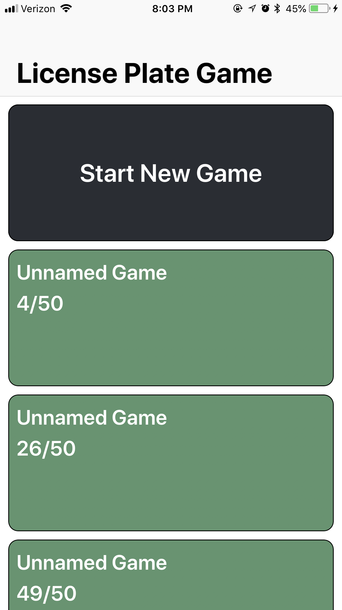
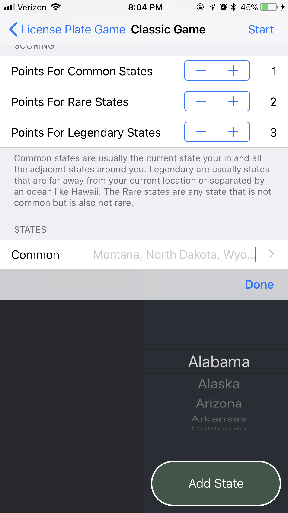
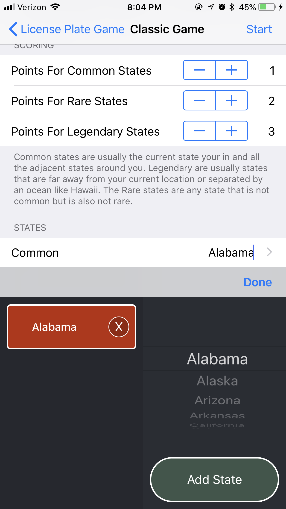
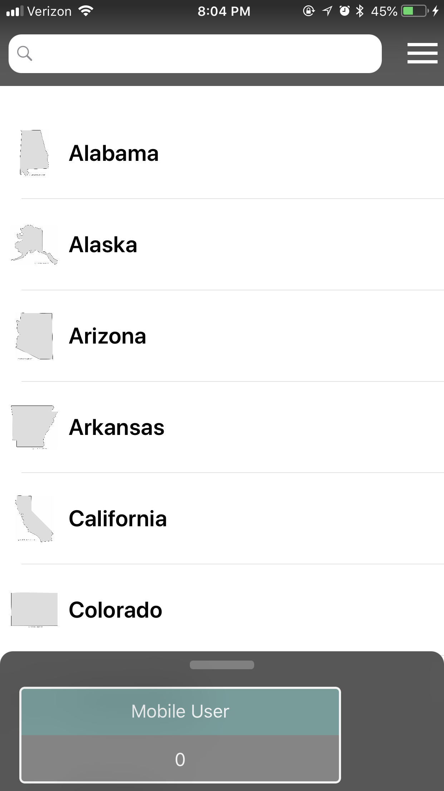
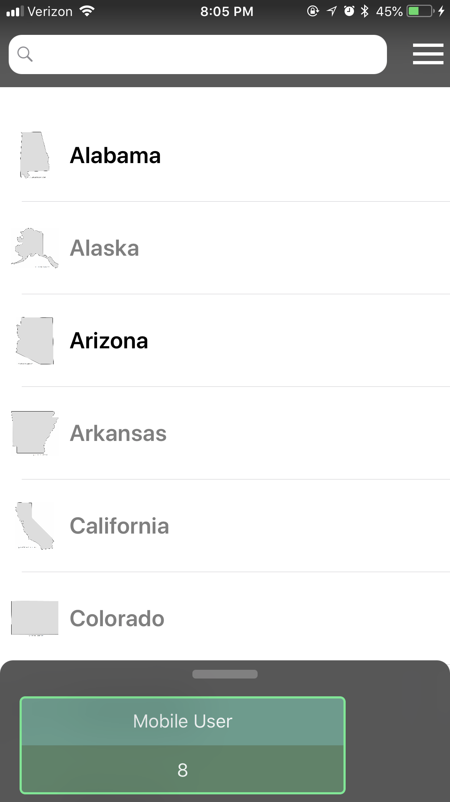
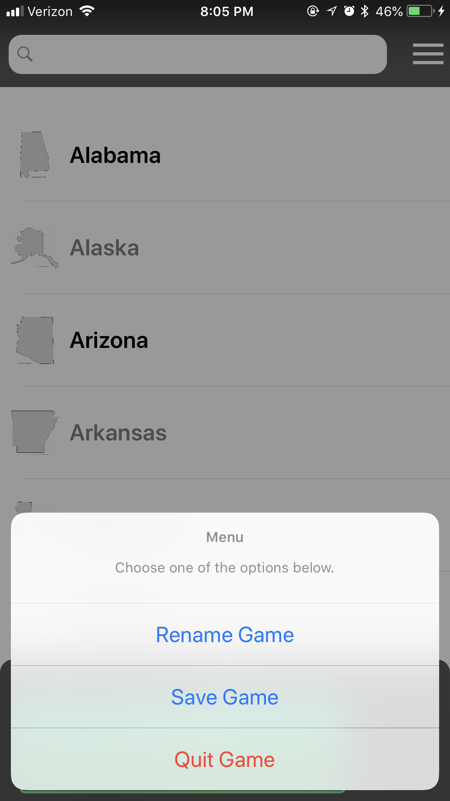

# Licence Plate Game

A recreation of the classic road trip game where you try to find as many state's license plates as possible.

## What I Used / Learned
- UICollectionViews
     - Custom Reusable Cell Classes
     - Custom Appear Animations (Using CATranformation)
- UITableViews
     - Custom Reusable Cell Classes
- Custom UITextField Input Views
- Custom Views (Subclassing UIView)
- Created Custom Delegates
- Used Storyboard and Programmatically added UI
- UIPropertyAnimator
- Core data (Insert, Update, Delete)
- Structs & Enums
- Auto Layout (Storyboard & Programmatically)
- UIPickerViews, UISearchBar

## Images

